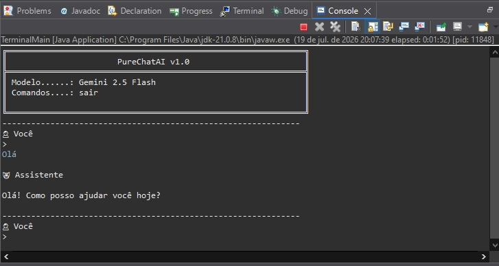

# 🤖 PureChatAI

> Uma integração simples entre Java puro e a API do Google Gemini, realizando o envio de prompts e exibindo as respostas geradas pela IA diretamente no terminal.

---

## 🎯 Sobre o projeto

**PureChatAI** é uma prova de conceito desenvolvida em **Java 21** com o objetivo de estudar a integração de uma aplicação Java com um modelo de Inteligência Artificial generativa.

O projeto realiza o consumo da **API do Google Gemini**, enviando prompts para o modelo e processando as respostas retornadas pela IA.

A implementação foi feita utilizando Java puro, explorando diretamente a comunicação via HTTP, autenticação por API Key e tratamento das respostas recebidas, sem utilização de frameworks específicos de IA.

---

## ⚙️ Funcionamento

O fluxo da aplicação é simples:

1. O usuário informa um prompt no terminal;
2. A aplicação Java envia a requisição para a API do Google Gemini;
3. O modelo processa a solicitação;
4. A resposta gerada pela IA é retornada e exibida diretamente no terminal.

### Exemplo de execução:

---

## 🛠️ Tecnologias utilizadas

- Java 21
- Google Gemini API
- Maven
- HTTP Client nativo do Java

---

## 📚 Objetivo do projeto

Este projeto foi criado para compreender, na prática, como funciona a integração entre uma aplicação Java e modelos de IA generativa, desde o envio da requisição até o recebimento e exibição da resposta.

O foco principal foi entender o processo de comunicação com uma API de Inteligência Artificial sem depender de abstrações prontas, fortalecendo os fundamentos de integração de serviços externos.
