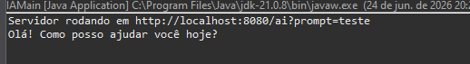
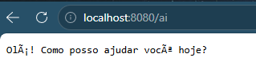

# 🤖 PureChatAI

> Um experimento em Java puro para entender, na raiz, como integrar uma aplicação backend com um modelo de IA generativa — sem frameworks, sem mágica, só HTTP e Java.


---

## 🎯 Sobre o projeto

**PureChatAI** é um projeto experimental desenvolvido em **Java** com o objetivo de estudar a integração com modelos de Inteligência Artificial através de APIs externas.

Esta versão representa uma **Prova de Conceito (PoC)**: um servidor HTTP simples, construído com a API nativa do Java (`com.sun.net.httpserver.HttpServer`), conversando diretamente com a **API do Google Gemini** — sem Spring, sem dependências de framework web, só o necessário pra entender o fluxo de ponta a ponta.

O projeto servirá como base para uma versão futura, com arquitetura mais robusta e uma interface moderna em React.

---

## 🚧 Status do projeto

**Em desenvolvimento.**

A versão atual é uma prova de conceito focada em validar a comunicação entre uma aplicação Java e um modelo de IA generativa — o foco aqui não é robustez, e sim entendimento profundo de cada camada envolvida.

> 🐞 **Bug conhecido:** caracteres acentuados aparecem corrompidos no console (`Olá` em vez de `Olá`) devido ao encoding padrão do terminal em alguns ambientes Windows. A resposta HTTP em si já é enviada corretamente em UTF-8. Ajuste planejado para uma próxima iteração, junto da evolução do backend.

---

## 🛠️ Tecnologias utilizadas

**Backend**
- Java 21
- Java `HttpServer` (nativo, sem framework)
- Google Gemini API
- Maven

**Futuro Frontend**
- React
- TypeScript
- HTML5
- CSS3

---

## 🧩 Como funciona

O núcleo do projeto é bem direto: a classe `GeminiService` encapsula a chamada ao modelo, recebendo um prompt e devolvendo o texto gerado.


Já a classe `Main` sobe um servidor HTTP puro na porta `8080`, expõe a rota `/ai`, extrai o `prompt` da query string, repassa pro `GeminiService` e devolve a resposta como texto plano:


### Testando em ação

No terminal, o servidor confirma que está rodando e loga a resposta gerada pela IA:



E direto no navegador, acessando a rota com um prompt, a resposta do Gemini é devolvida em texto puro:



### Monitorando o consumo da API

Acompanhando o uso no Google AI Studio, é possível visualizar o consumo de tokens de entrada e saída do modelo `Gemini 3.1 Flash Lite` durante os testes:


---

## ⚙️ Configuração

### 1. Obtenha uma API Key do Google Gemini

Acesse [aistudio.google.com](https://aistudio.google.com/) e crie uma API Key para utilização do projeto.

### 2. Configure sua API Key

Localize a classe responsável pela integração com o Gemini:

```
GeminiService.java
```

Substitua a chave de exemplo pela sua chave pessoal:

```java
private final String apiKey = "SUA_API_KEY";
```

Ou, preferencialmente, utilize variáveis de ambiente:

```java
private String apiKey = System.getenv("GEMINI_API_KEY");
```

**Windows:**
```bash
setx GEMINI_API_KEY "SUA_API_KEY"
```

**Linux:**
```bash
export GEMINI_API_KEY="SUA_API_KEY"
```

> Após configurar a variável de ambiente, reinicie sua IDE ou terminal.

---

## ▶️ Executando o projeto

Clone o repositório:
```bash
git clone https://github.com/seu-usuario/PureChatAI.git
```

Entre na pasta:
```bash
cd PureChatAI
```

Execute a aplicação:
```bash
mvn clean install
mvn exec:java
```

O servidor será iniciado na porta:
```
http://localhost:8080
```

---

## 🌐 Rotas disponíveis

### Gerar resposta da IA

**GET**
```http
/ai?prompt=SuaPergunta
```

**Exemplo:**
```
http://localhost:8080/ai?prompt=Explique%20o%20que%20é%20JWT
```

**Resposta:**
```
JWT (JSON Web Token) é um padrão utilizado para autenticação...
```

### Exemplo de uso

**Pergunta:**
```
http://localhost:8080/ai?prompt=O%20que%20é%20Java%3F
```

**Resposta:**
```
Java é uma linguagem de programação orientada a objetos...
```

---

## 🗺️ Roadmap

### Backend
- [x] Integração com Gemini API
- [x] Servidor HTTP em Java puro
- [x] Endpoint de geração de conteúdo
- [ ] Corrigir encoding de saída no console (acentuação)
- [ ] Requisições POST
- [ ] Processamento automático de JSON
- [ ] Sistema de rotas inspirado no Spring
- [ ] Injeção de dependências simples
- [ ] Tratamento global de exceções
- [ ] Histórico de conversas
- [ ] Persistência de dados

### Frontend
- [ ] Interface React
- [ ] Chat em tempo real
- [ ] Histórico de mensagens
- [ ] Design responsivo
- [ ] Tema escuro
- [ ] Integração completa com o backend

---

## 📚 Objetivo do projeto

O objetivo desta primeira versão é estudar:

- Desenvolvimento backend com Java
- Integração com APIs de Inteligência Artificial
- Comunicação HTTP
- Arquitetura de software
- Desenvolvimento fullstack

A próxima versão utilizará esta prova de conceito como base para a construção de uma plataforma completa de conversação com IA, contando com um backend mais robusto em Java e uma interface moderna desenvolvida em React.

---

## 👤 Autor

**Igor Rafael Silva Coelho**
Full Stack Software Engineer (Java/Angular)

---

⭐ Se esse projeto te ajudou a entender melhor integração de Java com IA generativa, deixa uma estrela no repositório!
