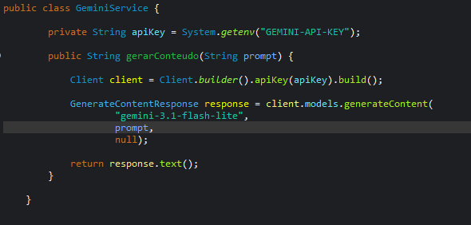
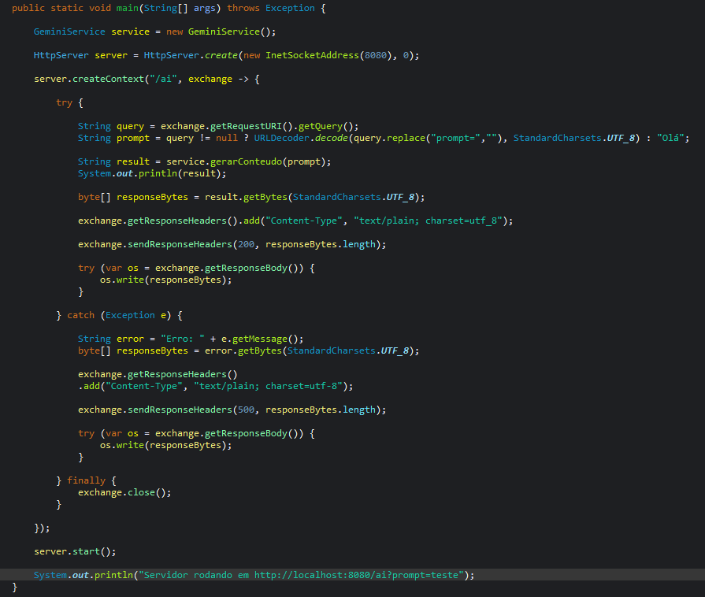
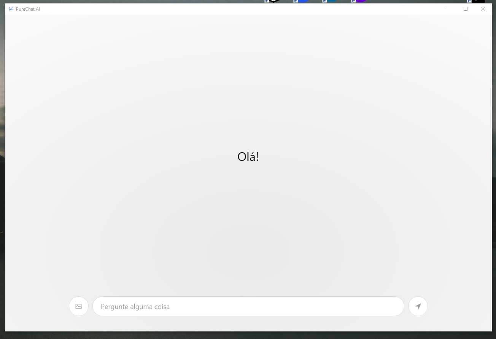
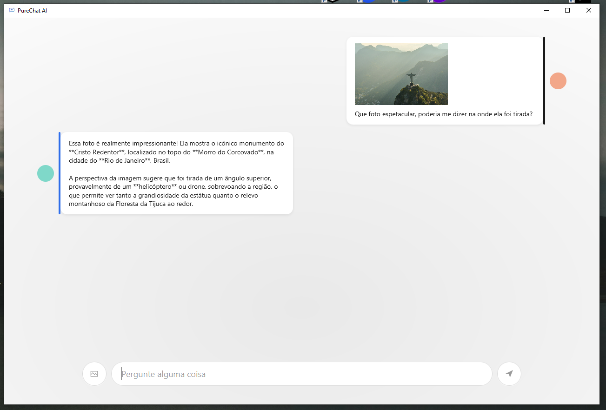
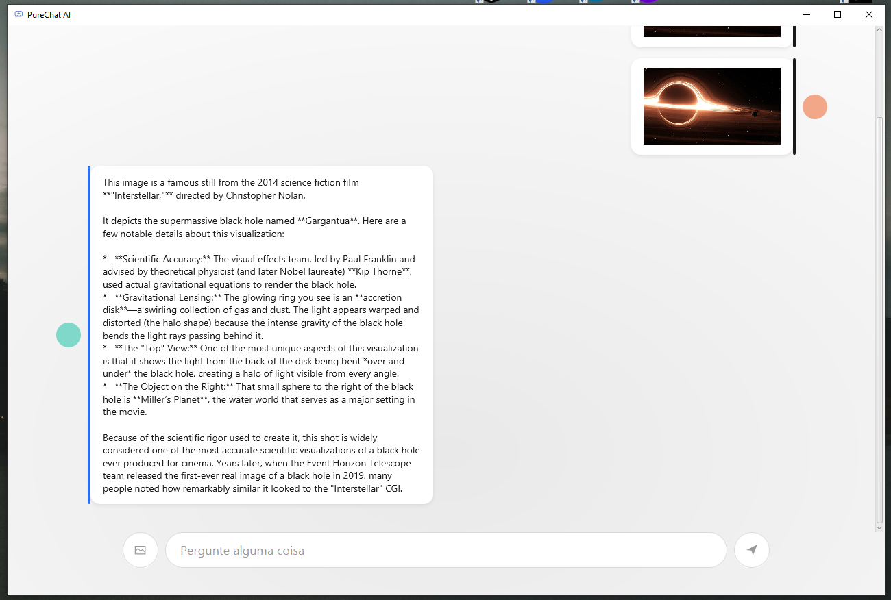
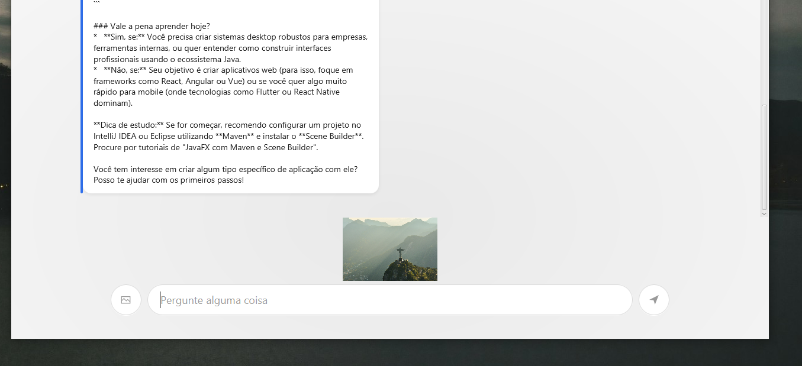
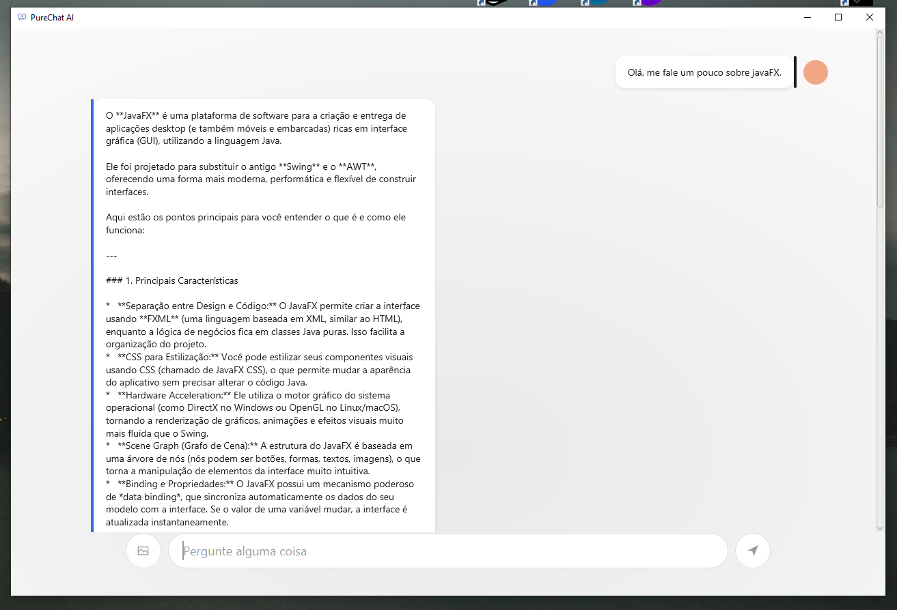
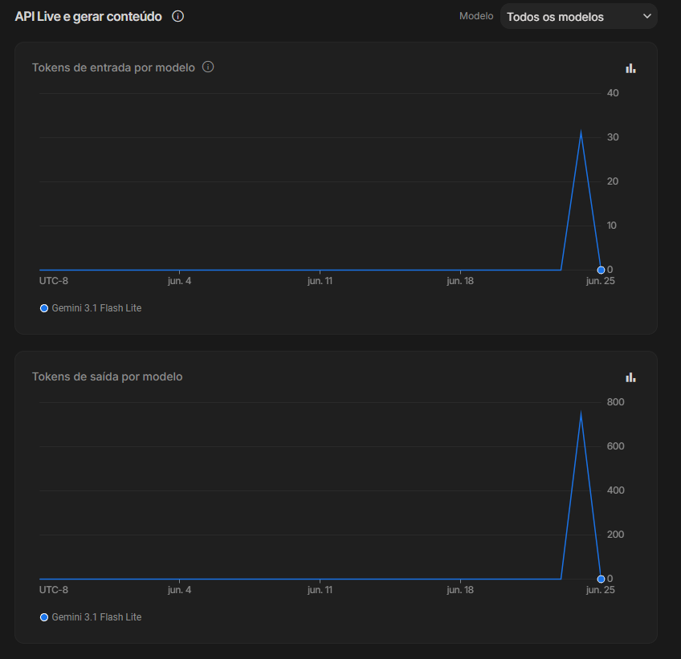

# 🤖 PureChatAI

> Um chatbot desktop em Java, feito para rodar leve até em máquinas fracas, nascido de um experimento simples sobre como integrar Java com um modelo de IA generativa, sem frameworks, sem mágica, só HTTP e Java.


---

## 🎯 Sobre o projeto

**PureChatAI** começou como um experimento simples: entender, na raiz, como integrar uma aplicação Java com um modelo de IA generativa através de APIs externas, um servidor HTTP construído com a API nativa do Java (`com.sun.net.httpserver.HttpServer`), conversando diretamente com a **API do Google Gemini**, sem Spring, sem framework web.

Durante o desenvolvimento, um problema prático ficou evidente: rodar tudo em um notebook com poucos recursos (4GB de RAM) enquanto o navegador fazia as requisições de IA tornava o processo lento e pesado. Isso foi o ponto de virada, o projeto deixou de ser só um estudo de integração e passou a ter um propósito real: **um chatbot leve, que não dependesse de navegador nem de infraestrutura pesada para funcionar bem.**

Hoje o repositório é organizado em três módulos independentes, cada um em sua própria pasta:

- **`desktop/`** — a interface **JavaFX** (foco atual do projeto), com bolhas de mensagem, upload de imagens e respostas formatadas, futuramente empacotada como `.exe`
- **`terminal/`** — versão via linha de comando, direto no console
- **`web/`** — versão original via navegador (rota HTTP `/ai`), mantida como alternativa mais simples

Ou seja: quem só quer usar o chatbot vai usar o `.exe` (pasta `desktop`). Quem quer estudar o código ou rodar sem instalar nada, clona o repositório e escolhe entre `terminal` ou `web`.

---

## 🚧 Status do projeto

**Em desenvolvimento.**

O foco atual está na interface JavaFX: bolhas de mensagem para usuário e IA, envio de imagens com preview, renderização de Markdown nas respostas (negrito, títulos, listas) e processamento assíncrono para manter a interface responsiva.

> 🐞 **Bug conhecido:** caracteres acentuados podem aparecer corrompidos em determinados pontos de saída (encoding), dependendo do ambiente. Ajuste planejado para uma próxima iteração.

---

## 🛠️ Tecnologias utilizadas

**Desktop / Interface**
- Java 21
- JavaFX
- Maven

**Backend / Integração IA**
- Java `HttpServer` (nativo, sem framework) ou chamadas HTTP diretas do próprio app
- Google Gemini API (texto e multimodal — upload de imagens)
- Processamento assíncrono (`Thread` + `Platform.runLater`) para não travar a interface durante a resposta da IA

**Empacotamento (planejado)**
- `.exe` para distribuição em Windows (via jpackage ou similar)

---

## 🧩 Como funciona

O núcleo da integração com IA está na classe `GeminiService`, que encapsula a chamada ao modelo: recebe um prompt (com ou sem imagem anexada) e devolve o texto gerado.



A versão `web` sobe um servidor HTTP puro na porta `8080`, expõe a rota `/ai`, extrai o `prompt` da query string, repassa pro `GeminiService` e devolve a resposta como texto plano:



### 🖥️ Versão Desktop (JavaFX)

A interface (`InterfaceAPP`) gerencia:
- A área de mensagens (bolhas de usuário e IA, com avatar e barra lateral de cor)
- O campo de input com envio por clique ou tecla Enter
- A transição da tela de boas-vindas ("Olá!") para a conversa ativa, assim que a primeira mensagem é enviada
- Upload de imagens via seletor de arquivo, com preview antes do envio e exibição da imagem dentro da própria bolha de mensagem
- Renderização de respostas em Markdown simples (negrito `**texto**`, títulos `###`, listas `*` e divisores `---`)
- Processamento da resposta da IA em uma thread separada, mantendo a interface responsiva enquanto aguarda

Tela inicial:



Conversa com envio de imagem — a IA analisa e responde sobre o conteúdo enviado:



Também é possível enviar apenas a imagem, sem nenhum texto:



A imagem selecionada aparece anexada diretamente na interface antes do envio:



E as respostas da IA já vêm formatadas (negrito, tópicos, títulos) para facilitar a leitura:



### ⌨️ Versão Terminal

Um cliente simples direto no console, com histórico de conversa na mesma sessão:


### Monitorando o consumo da API

Acompanhando o uso no Google AI Studio, é possível visualizar o consumo de tokens de entrada e saída do modelo Gemini durante os testes:



---

## ⚙️ Configuração

### 1. Obtenha uma API Key do Google Gemini

Acesse [aistudio.google.com](https://aistudio.google.com/) e crie uma API Key para utilização do projeto.

### 2. Configure sua API Key

Utilize uma variável de ambiente (recomendado):

```java
private String apiKey = System.getenv("GEMINI_API_KEY");
```

**Windows:**
```bash
setx GEMINI_API_KEY "SUA_API_KEY"
```

**Linux:**
```bash
export GEMINI_API_KEY="SUA_API_KEY"
```

> Após configurar a variável de ambiente, reinicie sua IDE ou terminal.

> 💡 Está prevista uma tela de configuração dentro do próprio app (API Key + modelo de IA), acessível na primeira execução e também depois via um ícone de engrenagem na tela de chat, permitindo trocar de credenciais ou modelo sem mexer em código ou variáveis de ambiente.

---

## ▶️ Executando o projeto

Existem duas formas de usar o PureChatAI:

### Opção 1 — Baixar o executável (mais simples, quando disponível)

Baixe o `.exe` disponibilizado nas releases do repositório e execute — não é necessário ter Java, Maven ou qualquer outra ferramenta instalada.

### Opção 2 — Clonar o repositório e rodar via código

Clone o repositório:
```bash
git clone https://github.com/seu-usuario/PureChatAI.git
```

Entre na pasta:
```bash
cd PureChatAI
```

A partir daqui, escolha o módulo que quer executar:

**Desktop (JavaFX)**
```bash
cd desktop
mvn clean install
mvn javafx:run
```

**Terminal**
```bash
cd terminal
mvn clean install
mvn exec:java
```

**Web (navegador)**
```bash
cd web
mvn clean install
mvn exec:java
```
O servidor será iniciado em `http://localhost:8080`.

---

## 🌐 Rotas disponíveis (versão Web)

### Gerar resposta da IA

**GET**
```http
/ai?prompt=SuaPergunta
```

**Exemplo:**
```
http://localhost:8080/ai?prompt=Explique%20o%20que%20é%20JWT
```

**Resposta:**
```
JWT (JSON Web Token) é um padrão utilizado para autenticação...
```

---

## 🗺️ Roadmap

### Backend / Integração
- [x] Integração com Gemini API
- [x] Servidor HTTP em Java puro (versão web)
- [x] Camada de serviço para chamadas HTTP simples
- [x] Upload e envio de imagens para a IA (multimodal)
- [x] Processamento assíncrono das respostas (thread separada)
- [ ] Suporte a envio de PDFs
- [ ] Suporte a envio de vídeos
- [ ] Corrigir encoding de saída (acentuação)
- [ ] Tela de configuração para API Key e modelo de IA
- [ ] Suporte a múltiplos provedores de IA (interface genérica)
- [ ] Histórico de conversas
- [ ] Persistência de dados local
- [ ] Tratamento global de exceções

### Desktop / Interface (JavaFX)
- [x] Tela inicial com saudação
- [x] Bolhas de mensagem (usuário e IA)
- [x] Área de mensagens rolável
- [x] Envio via Enter ou botão
- [x] Upload de imagem com preview antes do envio
- [x] Renderização de Markdown simples nas respostas (negrito, títulos, listas)
- [ ] Espaçamento e responsividade refinados
- [ ] Indicador de "digitando..." durante resposta da IA
- [ ] Tema escuro

### Distribuição
- [ ] Empacotamento como executável (`.exe`) via jpackage
- [ ] Otimização para rodar bem em PCs com poucos recursos
- [ ] Instalador simples para Windows
- [ ] Publicar `.exe` nas releases do repositório

---

## 📚 Objetivo do projeto

Este projeto tem como objetivo estudar e aplicar:

- Desenvolvimento de interfaces desktop com JavaFX
- Integração com APIs de Inteligência Artificial, incluindo entrada multimodal (texto + imagem)
- Comunicação HTTP simples, sem overhead de frameworks
- Programação assíncrona em interfaces desktop (threads e atualização segura de UI)
- Arquitetura de software voltada a aplicações leves e distribuíveis
- Empacotamento de aplicações Java como executáveis nativos

A meta final é ter um chatbot desktop funcional, leve, fácil de distribuir e capaz de rodar em máquinas com recursos limitados — sem depender de navegador ou infraestrutura pesada. O projeto nasceu de uma necessidade real: notebooks e PCs mais fracos não deveriam ficar de fora de uma boa experiência com IA generativa.

---

## 👤 Autor

**Igor Rafael Silva Coelho**
Full Stack Software Engineer

---